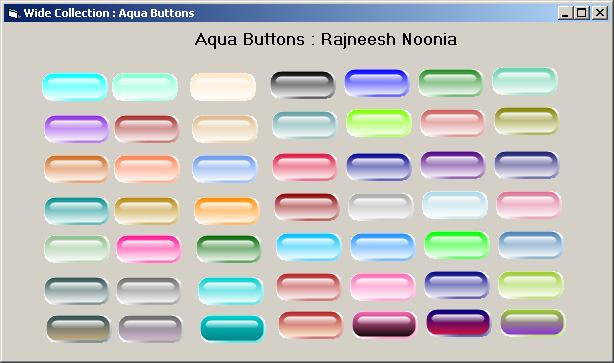



## Aqua Buttons \(GDI\+\)

### Description

An example on how to use some of the GDI+ methods to create a simple Aqua button in VB 6.0.By changing StartColor,EndColor and LightIntensity properties you can create the buttons of your choise.With few lines of code you can also save the button as any picture format support by GDI+ which can be further used in your web sites.You may extent the idea to create round or any shaped buttons with aqua effect.You may also add mouse over effects and click effects easily.You may add properties like Caption,Enable, Font etc..
 
### More Info
 

             |
---                |---
**Submitted On**   |2003-02-06 23:40:34
**By**             |[Rajneesh Noonia](https://github.com/Planet-Source-Code/PSCIndex/blob/master/ByAuthor/rajneesh-noonia.md)
**Level**          |Advanced
**User Rating**    |3.7 (41 globes from 11 users)
**Compatibility**  |VB 3\.0, VB 4\.0 \(16\-bit\), VB 4\.0 \(32\-bit\), VB 5\.0, VB 6\.0, VB Script, ASP \(Active Server Pages\) 
**Category**       |[Custom Controls/ Forms/  Menus](https://github.com/Planet-Source-Code/PSCIndex/blob/master/ByCategory/custom-controls-forms-menus__1-4.md)
**World**          |[Visual Basic](https://github.com/Planet-Source-Code/PSCIndex/blob/master/ByWorld/visual-basic.md)
**Archive File**   |[Aqua\_Butto2022891032006\.zip](https://github.com/Planet-Source-Code/rajneesh-noonia-aqua-buttons-gdi__1-66692/archive/master.zip)

